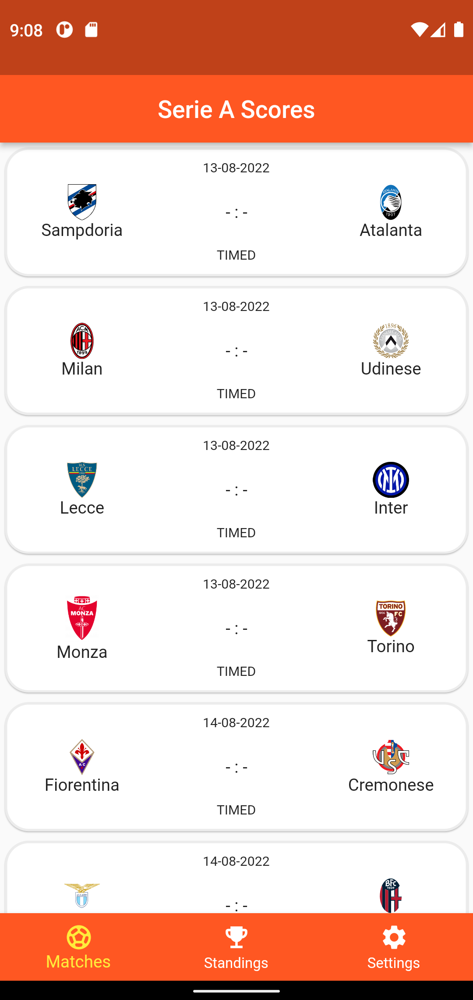
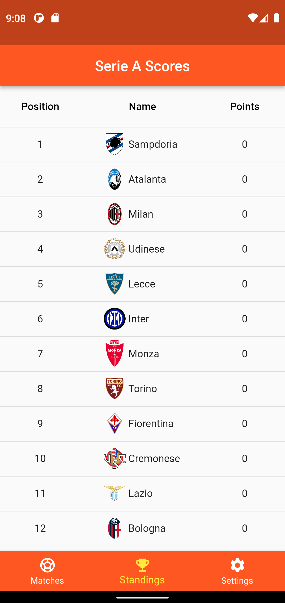
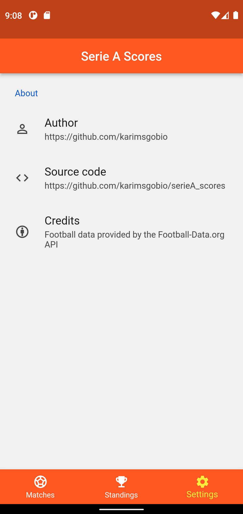

# Serie A scores  

An app that tracks the latest serie A results.  

Football data provided by the [Football-Data.org](https://www.football-data.org/) API.  

If you want to use the code you need to modify the `.env.example` file, insert your API key (get an API key at [API website](https://www.football-data.org/)) and rename it in `.env`.  

## Screenshots  

###### Matches  
  

###### Standings  
  

###### Settings  
  
